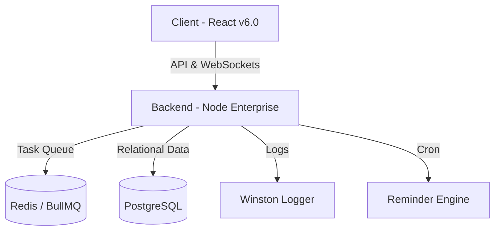

# 🏥 MHRS v6.0 Enterprise - T.C. Sağlık Bakanlığı Simülasyonu

Bu proje, modern bir hastane randevu sisteminin (MHRS) Türkiye Cumhuriyeti ölçeğinde, kurumsal standartlarda geliştirilmiş en gelişmiş sürümüdür. 81 ilin tamamını, tüm ilçeleri ve devasa bir doktor/poliklinik veri setini kapsayan bu sistem; yüksek güvenlik, gerçek zamanlı veri senkronizasyonu ve gelişmiş kullanıcı deneyimi odaklıdır.

## ✨ v6.0 Enterprise Yenilikleri

### 🏗️ v7.0 Enterprise Modül Genişletmeleri

- **Doktor Paneli:** yaklaşan randevu, bekleme listesi, reçete kalemi ve laboratuvar sonucu yönetimi.
- **Gelişmiş Admin Dashboard:** kurumsal metrikler + merkezi audit log izleme.
- **Bildirim Merkezi:** in-app bildirim listeleme, okundu işaretleme, websocket canlı bildirimler.
- **Çok adımlı randevu akışı:** taslak kaydetme (`AppointmentDraft`) ve adım bazlı ilerleme.
- **Sağlık Geçmişi Profili:** alerji, kronik hastalık, ilaç ve acil iletişim bilgisi yönetimi.
- **Audit Log Sistemi:** kritik aksiyonların izlenebilir şekilde kayıt altına alınması.

### 🌐 v8.0 Mobil & Sürekli Entegrasyon (Son Özellikler)

- **Çoklu Dil (i18n) Desteği:** Sistemin Türkçe ve İngilizce dahil birden fazla dil desteğine sahip olması.
- **PWA (Progressive Web App):** Uygulamanın mobil cihazlara kurulabilmesi, çevrimdışı önbellekleme yetenekleri.
- **CI/CD Pipeline (Jenkins):** Otomatik test, derleme ve deployment süreçlerinin Jenkins üzerinden yönetilmesi.
- **Performans & Güvenlik:** Redis önbellek hatalarının giderilmesi, JWT auth entegrasyonu ve kararlı veritabanı iletişimi.

## 🔌 Yeni API Modülleri (Özet)

- `GET /api/enterprise/doctor-panel`
- `GET|PUT /api/enterprise/health-profile`
- `GET|POST /api/enterprise/notifications`, `PATCH /api/enterprise/notifications/:id/read`
- `GET|POST /api/enterprise/appointment-drafts`
- `GET /api/enterprise/prescription-items/:appointmentId`, `POST /api/enterprise/prescription-items`
- `GET /api/enterprise/lab-results/:appointmentId`, `POST /api/enterprise/lab-results`
- `GET /api/enterprise/admin-dashboard`
- `GET /api/enterprise/audit-logs`
- `POST /api/enterprise/slot-update`

### 🌍 Türkiye Geneli Veri Entegrasyonu

- **81 İl & Tüm İlçeler:** Türkiye'nin 81 ilinin tamamı ve her ile ait ana ilçeler sisteme entegre edilmiştir.
- **Gerçekçi Kurumlar:** "Çam ve Sakura Şehir Hastanesi", "Ankara Bilkent", "Bakırköy Dr. Sadi Konuk" gibi gerçek hastane isimleri ve profesyonel poliklinik yapıları.
- **Enterprise Scale Seed:** Veritabanı 300+ uzman doktor ve yüzlerce kategorize edilmiş poliklinik ile doldurulmuştur.

### 🩺 E-Nabız & Kişisel Sağlık Verisi

- **Visit History:** Kullanıcının geçmiş muayene kayıtları, tanıları ve raporları (E-Nabız Simülasyonu).
- **Akıllı Tanıma:** Arama sonuçlarında daha önce muayene olduğunuz doktorlar `💓 ÖNCEKİ MUAYENE` rozeti ile vurgulanır.
- **Aile Fertleri:** Anne, baba ve çocuk gibi bağımlı kişileri ekleyip onlar adına randevu alabilme özelliği.

### 🤖 Akıllı Yardımcılar (AI Helper)

- **AI Symptom Checker:** Belirtilerinize göre (Örn: "Boğazım ağrıyor") size en uygun branşı (Kulak Burun Boğaz) öneren akıllı asistan.
- **Gelişmiş Filtreleme:** Poliklinikleri branş bazlı (Kardiyoloji, Göz vb.) gruplandırılmış ve alfabetik sıralanmış şekilde filtreleme.

## 🚀 Teknolojik Mimari

- **Frontend:** React.js (Vite), TailwindCSS, Glassmorphism UI, Framer Motion (Mikro-animasyonlar).
- **Backend:** Node.js, Express.js.
- **Veritabanı:** **PostgreSQL** (Prisma ORM) - SQLite'dan kurumsal geçiş.
- **Queue Management:** **BullMQ** (Redis tabanlı asenkron görev yönetimi).
- **Notifications:** WebSockets (Live updates), Nodemailer (E-mail reminders), Node-cron (24h/1h reminders).
- **Security:** JWT (Access/Refresh), RBAC (Admin/Doctor/User), Helmet, Rate Limiting, CORS.
- **CI/CD & DevOps:** Docker, Docker Compose, Jenkins Pipeline.
- **Documentation:** Swagger (OpenAPI 3.0).

## 💽 Kurulum ve Çalıştırma (Docker)

Sistemi tüm bağımlılıkları (PostgreSQL, Redis, Server, Client) ile tek seferde ayağa kaldırmak için:

```bash
docker-compose up --build -d
```

### 🔁 Jenkins CI/CD Nasıl Çalıştırılır?

Projenin entegre CI/CD sürecini test etmek veya arka plan `akış` (pipeline) süreçlerini başlatmak için ayrı bir docker-compose yapımız mevcuttur:

```bash
# Jenkins'i başlatmak için:
docker-compose -f docker-compose.jenkins.yml up -d

# Jenkins Loglarını İzlemek için:
docker logs -f mhrs_jenkins
```

Jenkins arayüzüne **`http://localhost:8080`** adresinden erişebilirsiniz. İlk kurulum için admin şifresi loglarda görünecektir.

**Varsayılan Erişimler:**

- **Frontend:** `http://localhost:5173`
- **Backend:** `http://localhost:3000`
- **API Docs:** `http://localhost:3000/api-docs`

## 🔑 Varsayılan Kullanıcı (v6.0 ENT)

Sistemi tam yetkiyle test etmek için:

- **E-Posta:** `admin@mhrs.gov.tr`
- **Şifre:** `admin123`

## 👨‍⚕️ Doktor Paneli Demo Kullanıcısı

- **E-Posta:** `doctor@mhrs.gov.tr`
- **Şifre:** `doctor123`
- **Panel URL:** `http://localhost:5173/doctor-panel`

---

## 📂 Dosya Yapısı



---
**Geliştirme Raporu:** Yapılan tüm teknik iyileştirmelerin ve doğrulama kanıtlarının detaylı dökümüne [Walkthrough Raporu](file:///C:/Users/gizem/.gemini/antigravity/brain/cd7f39aa-0b7d-4e2d-a9b8-0ad01ec2760d/walkthrough.md) üzerinden ulaşabilirsiniz.
