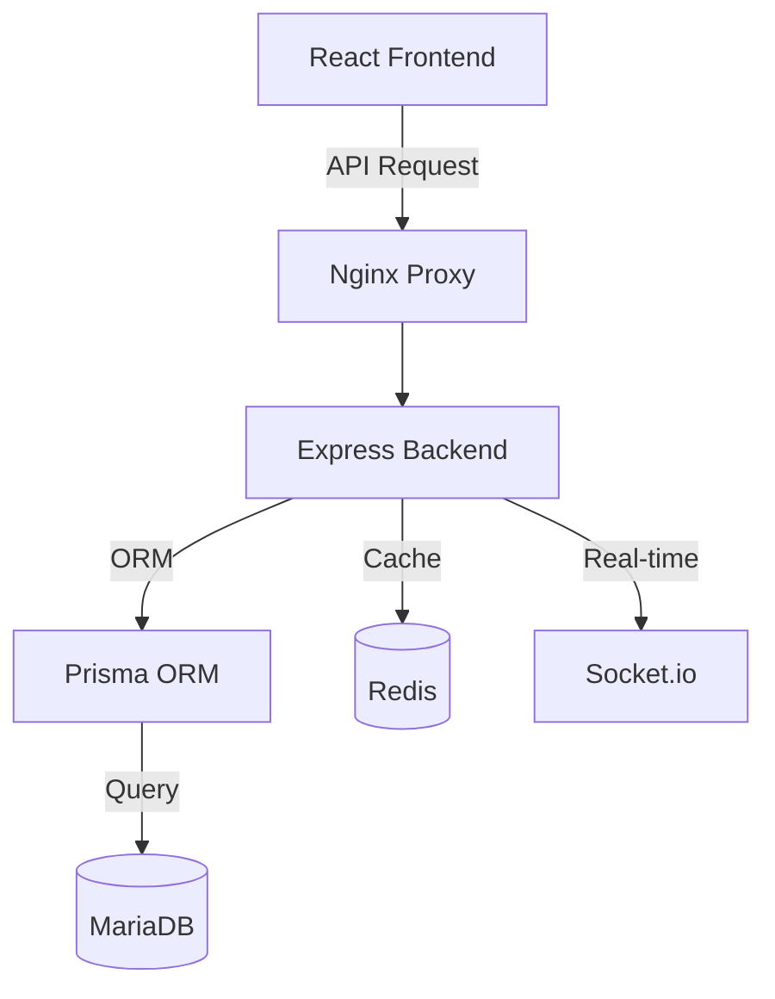

# MHRS Kurumsal Modernizasyon Projesi (v8.0 Professional)


Bu proje, Türkiye Cumhuriyeti Sağlık Bakanlığı Merkezi Hekim Randevu Sistemi'nin (MHRS) modern teknolojilerle (MariaDB, Node.js, React, Docker) yeniden tasarlanmış, yüksek performanslı ve kurumsal standartlara uygun versiyonudur.

## 🚀 Öne Çıkan Özellikler

- **MariaDB Enterprise Veritabanı:** SQLite'tan yüksek ölçeklenebilir MariaDB 10.6 mimarisine tam geçiş.
- **81 İl & 1700+ Hekim Kapasitesi:** Tüm Türkiye'yi kapsayan gerçekçi veri seti (Seed script ile otomatik yüklenir).
- **6 Aşamalı Randevu Sihirbazı:** 
  1. İl/İlçe Seçimi
  2. Hastane (Klinik) Filtreleme
  3. Poliklinik (Branş) Seçimi
  4. Hekim Seçimi
  5. Tarih & Saat Belirleme
  6. Onay Sistemi
- **Hekim Paneli (Advanced):** Muayene notları, reçete yönetimi ve bekleyen randevuları "Onayla/İptal Et" mekanizması.
- **Audit Log Sistemi:** Tüm kritik işlemlerin (Giriş, Randevu Oluşturma, Onay) veri güvenliği için izlenmesi.
- **Docker Konteynerizasyon:** Tek komutla (Docker Compose) ayağa kalkan izole çalışma ortamı.
- **PWA & Offline Destek:** Mobil uyumlu ve yüklenebilir uygulama altyapısı.

## 🛠 Teknoloji Yığını

- **Frontend:** React 18, Vite, Tailwind CSS, Framer Motion (Animasyonlar), Lucide Icons.
- **Backend:** Node.js, Express, Prisma ORM, Socket.io (Anlık Bildirimler).
- **Veritabanı:** MariaDB (Veri), Redis (Caching & Rate Limiting).
- **DevOps:** Docker, Jenkins CI/CD Pipeline.

## 📦 Kurulum ve Çalıştırma

Proje tamamen Dockerize edilmiştir. Çalıştırmak için sisteminizde Docker'ın kurulu olması yeterlidir:

```bash
# Projeyi klonlayın
git clone https://github.com/gizemakkaya2307-hue/mhrs
cd mhrs

# Uygulamayı başlatın (Veritabanı otomatik oluşturulur ve seed edilir)
docker-compose up -d --build
```

Uygulama ayağa kalktığında:
- **Frontend:** [http://localhost:5173](http://localhost:5173)
- **API Server:** [http://localhost:3000](http://localhost:3000)
- **MariaDB:** `localhost:3307` (Root: mhrs_pass)

## 🔑 Test Hesapları

Geliştirme ve test süreçleri için aşağıdaki hesapları kullanabilirsiniz:

| Rol | E-posta | Şifre |
| :--- | :--- | :--- |
| **Yönetici** | `admin@mhrs.gov.tr` | `12345678` |
| **Hekim** | `doctor@mhrs.gov.tr` | `12345678` |
| **Vatandaş** | `user@mhrs.gov.tr` | `12345678` |

## 📐 Mimari Yapı



## 📝 Modernizasyon Notları

Proje kapsamında yapılan son güncellemeler:
1. **Node.js 20 Geçişi:** Daha yüksek performans ve kütüphane uyumluluğu için runtime güncellendi.
2. **Context Optimizasyonu:** Docker build süreleri `.dockerignore` ile %90 oranında düşürüldü.
3. **Randevu Akışı:** V6 legacy kodlar temizlendi ve modern UX standartlarında "Wizard" yapısına geçildi.

---
*Bu proje eğitim ve kurumsal modernizasyon demosu amacıyla geliştirilmiştir.*
